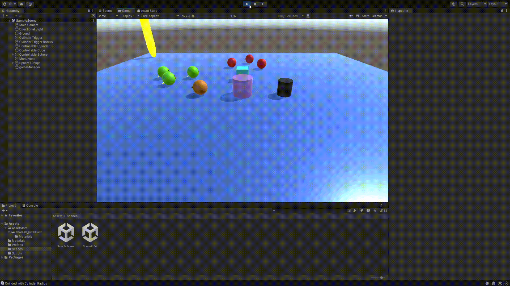
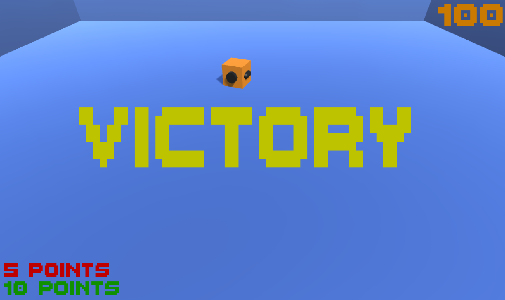

# Interfaces Inteligentes - Práctica 04 : Delegados, Eventos  

- Autor: Thomas Edward Bradley  
- Fecha: 17/10/23  

## Resumen  
Tratamos con eventos (para comunicación entre GameObjects) y Canvas (para temas de la UI). También cabe 
mencionar que para la practica he creado 2 escenas, una primera para los tres primeros puntos y la segunda 
para los restantes. Además se han utilizado scripts de la práctica anterior, las cuales se han modificado 
(estas estarán dentro del repositorio y se comentaran en los momentos oportunos en este documento).

## Tarea 01  
  
Para esta tarea creé los scripts 'detectCollision.cs', 'sphereGroup01.cs' y 'sphereGroup02.cs' (las dos últimas se van a 
usar mucho en las siguientes tareas). Dentro de esta primera creamos un mensaje y un evento, al detectar una colisión con
el cubo (tag 'Cube'), esta activara el evento. Ahora dentro de los otros dos scripts nos suscribimos a 'detectCollision' en 
el start(). Para el grupo 01 le pasamos el control a cambioColor() para cambiar el color a newMat02 y para el grupo 02 a 
moveToCylinder() donde se habilita un bool privado 'movement' (este controla si en update movemos el objeto hacia el cilindro). 
También cabe mencionar que le quite la propiedad cinematica al cubo controlado por el usuario para que se detecten las colisiones 
de forma apropiada. Otro dato importante es que las esferas de ambos grupos se han guardado como dos prefabs distintos, de modo
que estas se puedan configurar de manera generalizada.

## Tarea 02  
   
Para esta tarea y la siguiente uso 'cubeCollision.cs' para gestionar los eventos y las colisiones. Aqui observamos si el cubo colisiona 
con un objeto, si este es el caso, miramos a ver si pertenece al grupo 01 (enviamos mensaje group01Collision) u otro objeto que no sea el 
suelo (enviamos mensaje collision). Cuando las esferas del grupo 2 reciben group01Collision (nos suscribimos a ello en start()) se activa 
la función grow() el cual incrementa el tamaño de las mismas. Al igual, cuando se recibe el mensaje collision en las esferas del grupo 01, estas 
empiezan a moverse hacia el cilindro (de igual manera que las del grupo 02 en la tarea previa, empleando un bool).

## Tarea 03
  
Lo primero que hice aqui fue agregar rigidbodies a las esferas del grupo 01 (ya que les hara falta para poder saltar), además, agregue otro cilindro
el cual puse sobre nuestro cilindro trigger. A este nuevo le incremente de tamaño, lo active como trigger, desactive su renderer y jugue con el tamaño de 
su collider (de este modo tenemos un trigger que no se puede ver pero el cual detecta si un objeto se acerca al cilindro, es importante mencionar que 
este no puede ser hijo del cilindro ya que se trataria con el mismo tag, lo cual activaria los efectos del propio cilindro cuando estas no deben ser activadas). 
Ahora empleamos el mismo proceso que en las otras dos tareas (en 'cubeCollsion.cs') pero evaluando OnTriggerEnter() y solo enviando un mensaje para ambos grupos. 
Reescribí el código de 'sphereGroup01.cs' para que tratara su movimiento con rigidbodies y no tranform, y le agregue la función cambioColorSalto() que cambia el color 
de las esferas a newMat01 y les hace saltar una altura jumpHeight. Para las esferas del grupo 02, les añadi geometria (quitando los colliders) para que tengan aspecto 
de pajaro (para saber en que sentido estan mirando), luego añadi la función point() para que mirasen hacia un nuevo GameObject 'monument' cuando se les envie este nuevo 
mensaje.

## Tarea 04
  
Para esta tarea opté por crear una nueva escena y trabajar en ello en lugar de dejarlo para el final. Empeze añadiendo un cubo a controlar, suelo / paredes (agrupados en environment), ajustando la camara 
y creando nuevos prefabs de bolas (las cuales van a ser recogidas por el usuario controlando el cubo, teniendo tags y materiales apropiados). Para el movimiento de esta utilice el 
script 'controlSphere.cs' de la práctica anterior (la cual modifique para que pueda ser controlada con todas las teclas de input, pero manteniendo la opción de restringirlo para 
no arruinar la práctica previa), también le agregue geometria para saber en que sentido esta mirando (quitando los collider). Además agregue un gameManager, el cual se encargara de sumar la puntuación 
obtenida y distribuir esta donde sea necesario. Creé los scripts 'cubePointCollision.cs' y 'pointManager.cs'. La primera se lo asigne al cubo, esta envia un mensaje a traves de un evento cuando se choca contra 
una esfera (este mensaje siendo fivePoints o tenPoints dependiendo de la esfera con la que choco), tras esto hace un Destroy() del GameObject con el que colisiono. El pointManager (puesto en el gameManager) recibe el mensaje enviado 
y suma 5 o 10 puntos a una variable points que tiene (imprimiendo el nuevo resultado por consola tras esto). También incremente la masa del cubo a 5 para que esta se sienta mejor a la hora de controlar.

## Tarea 05
  
Primero creamos un canvas, al cual le agregamos texto (como no me gusto el font por defecto busque una nueva en la unity asset store). Incorporé texto descriptivo sobre la puntuación en la esquina izquierda inferior y 
un texto para la puntuación obtenida en la derecha superior. Ademas puse un texto grande en amarillo (en blanco de momento) en el centro de la pantalla para insertarle texto en el caso de que se consiga los 100 puntos totales. 
Ahora dentro del pointManager añadimos 'using UnityEngine.UI;' y declaramos una nueva variable Text llamado pointText. Dentro de update actualizamos este texto para que muestre la puntuación obtenida hasta el momento. Repetimos estos pasos 
para victoryText pero solo le metemos 'Victory' a esta si la puntuación llega a 100.  
  
Intente adaptar el canvas para que esta fuese igual a pesar de la resolución del dispositivo pero después de experimentar con ello un rato no lo pude conseguir.

## Tarea 06
Esta tarea lo cumplí con lo desarrollado en las últimas dos. 